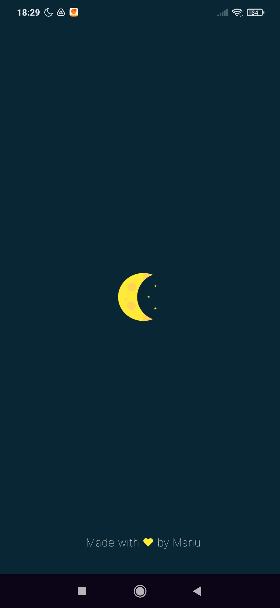
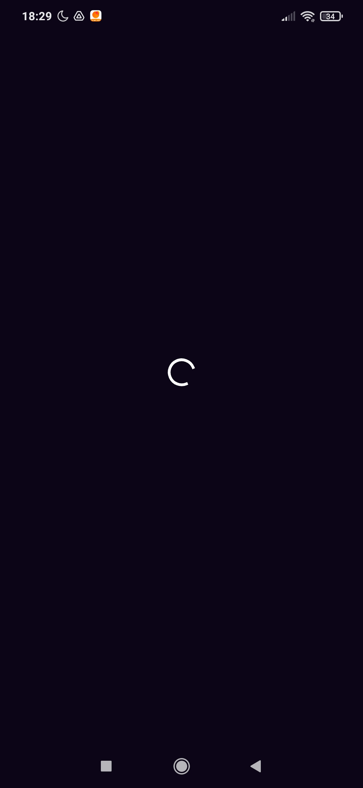
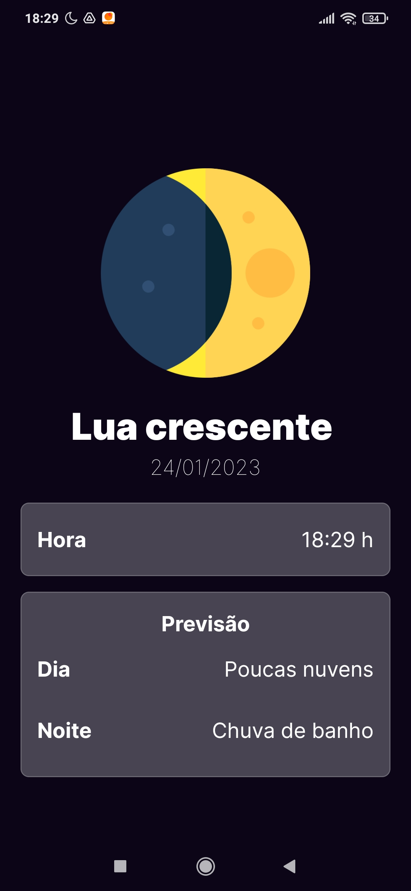
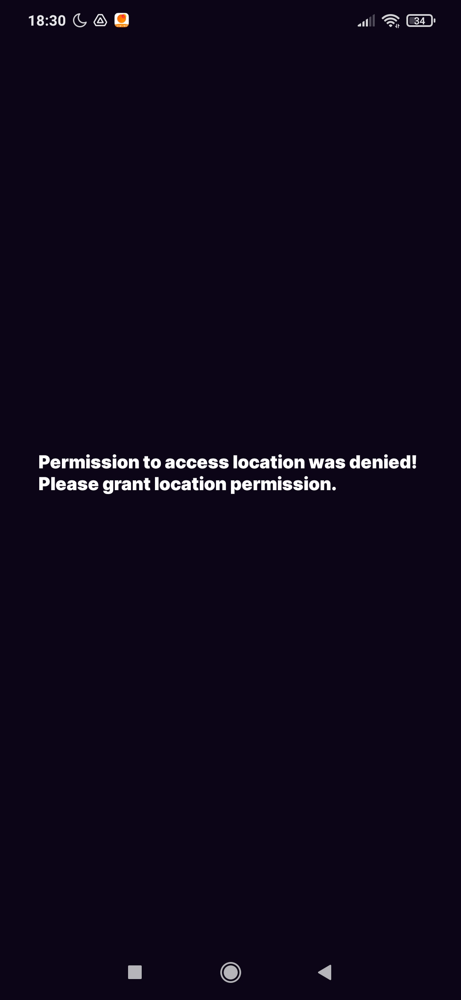

<!-- ICON MOON PHASES APP -->
<div align="center">
   
</div>

<!-- Shields -->
<div align="center">
  <!---->
  <!---->
  <!---->
  
  <a href="https://github.com/EmmanuellaAlbuquerque/MoonPhasesApp/blob/main/LICENSE">
  
  </a> 
</div>

<p align="center">Aplicativo para acompanhar as fases da lua.</p>

# Moon Phases App

<div align="center">
  
</div>

## :art: Telas

|Splash Screen|Loading Screen|App Screen|Permission Screen|
|:---:|:---:|:---:|:---:|
||</div>|||

## :mag_right: Sobre

O projeto MoonPhasesApp exibe em qual fase a lua se encontra no dia em questão e, fornece informações sobre a previsão do clima durante o dia e noite.

## ✨ Tecnologias
Esse projeto foi desenvolvido com as seguintes tecnologias:

- [React-Native](https://reactnative.dev/)
- [Expo](https://expo.dev/)
- [API Q Weather](https://dev.qweather.com/en/docs/api/weather/weather-now/)

## :rocket: Executando o projeto

Utilize o **yarn** ou o **npm install** para instalar as dependências do projeto.
Em seguida, inicie o projeto.

```sh
npx expo start
```

Lembre-se de obter a API KEY do Dev QWeather ([API Config](https://dev.qweather.com/en/docs/configuration/api-config/)). Em seguida, defina o arquivo .env na home do projeto.
 
 ```sh
# .env.example

Q_WEATHER_KEY=
```

## :iphone: Gerando o apk

```sh
# Importing secrets from a dotenv file
eas secret:push --scope project --env-file .env

# Build for Android Emulator/device
eas build -p android --profile preview
```

## :link: Links

Código dos ícones utilizado para referenciar as imagens das fases da lua correspondentes:

- [Moon phase icons](https://dev.qweather.com/en/docs/resource/icons/#moon-phase-icons)

## :memo: Licença

Esse projeto está sob a licença do MIT. Veja o arquivo [LICENSE](LICENSE) para mais detalhes.

## ✍️ Autor

<a href="https://github.com/EmmanuellaAlbuquerque">
  
</a>


Made with ❤️ by <a href="https://github.com/EmmanuellaAlbuquerque">Manu</a>
